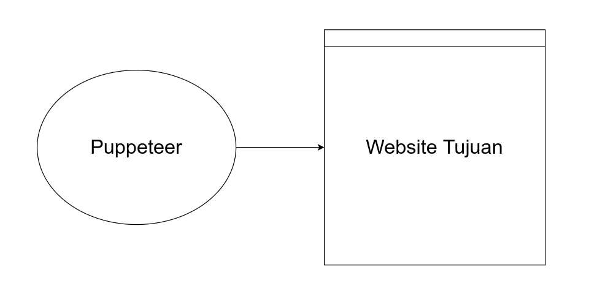
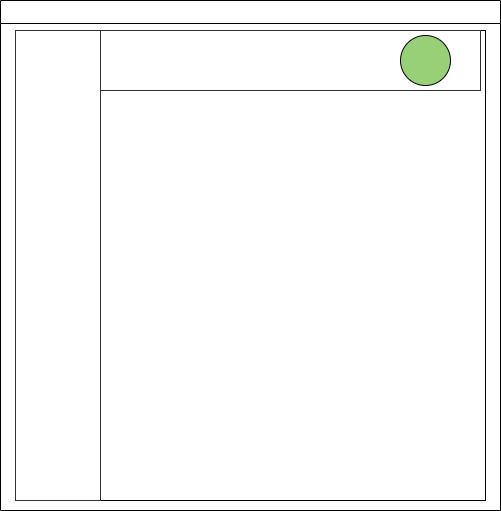
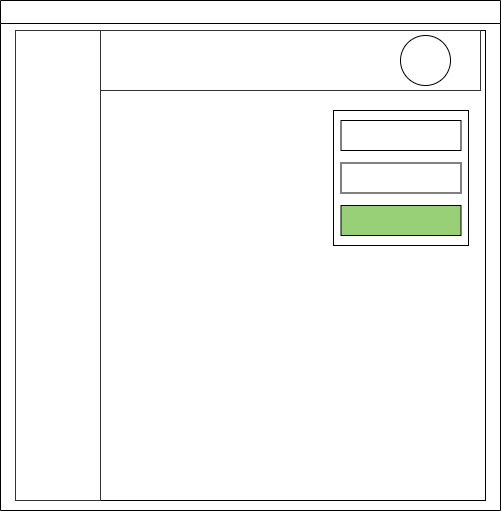
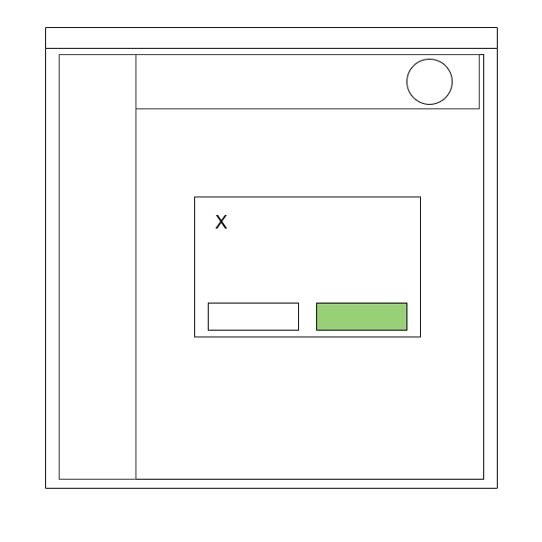
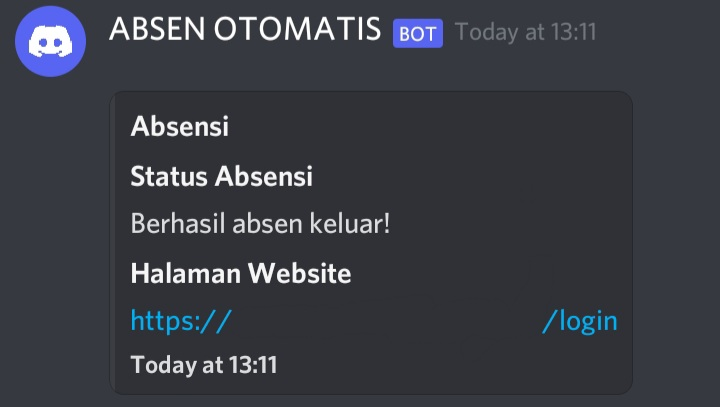
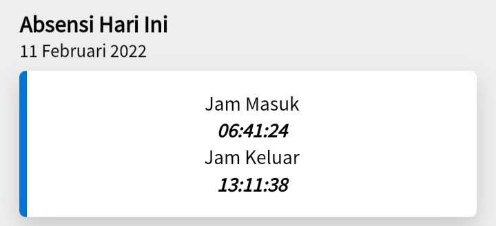
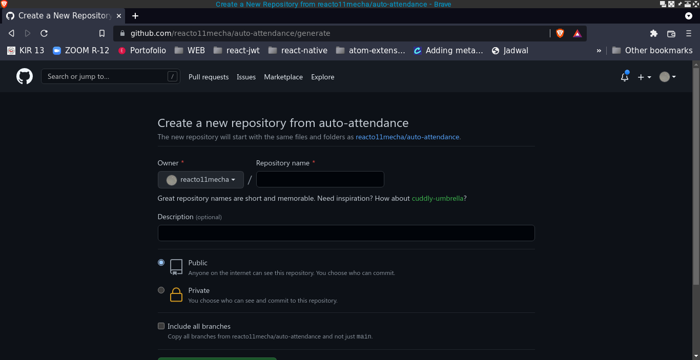
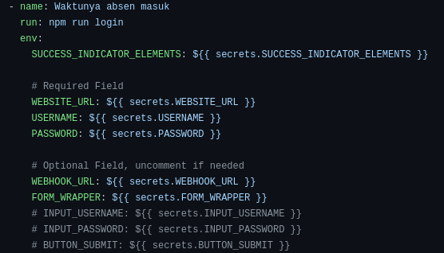

# Auto Attendance

Sesuai nama repositorinya, ini adalah bot absen otomatis dengan menggunakan puppeteer.

### Latar belakang bot ini dibuat

Saya adalah siswa sekolah yang mengikuti proses belajar mengajar secara daring melalui website LMS (Learning Management System). Website itu dalam melaksanakan absensi cukup menyulitkan, sebagai siswa setiap mau absen harus logout dan login kembali agar bisa dianggap sudah absen. Jadi cukup membuang waktu hanya untuk melakukan hal itu berkali-kali untuk absen saja. Hal yang sama juga diterapkan untuk absen keluar, kita diperlukan logout untuk dinyatakan sebagai absen keluar.

### Cara Kerja Bot

##### Pada Saat Login

Bot ini sangat dibantu oleh library [puppeteer](https://github.com/puppeteer/puppeteer) sebagai Headless Chrome yang bisa mengunjungi web dan melakukan sesuatu di web tersebut layaknya manusia berinteraksi dengan web. Yang pertama kali dilakukan oleh botntya yaitu mengunjungi webnya.



Ketika webnya sudah selesai di kunjungi, bot akan mencari elemen-elemen yang bisa digunakan untuk mengetikan username/email dan password.


Ketika elemen-elemen yang dimaksud sudah sesuai maka selanjutnya adalah proses pengisiian username dan password, serta di kliknya tombol login.


Ketika tombol login sudah diklik dan sudah dipastikan web berpindah halaman, selanjutnya akan mendeteksi elemen baru apakah berhasil login ke halaman setelah login dengan mendeteksi beberapa elemen yang ada.


Dan ketika ditemukan URL Discord Webhook, bot nya akan mengirimkan laporan ke discord bahwa proses absensi berhasil.


---

##### Pada Saat Logout

Pada saat logout, yang dilakukan bot ini adalah kembali melakukan proses login dengan prosedur yang sama. Setelah dinyatakan berhasil login, selanjutnya bot mendeteksi apakah ada elemen profil pengguna dan memencetnya jika ada.



Ketika sudah dipencet, selanjutnya akan mencari tombol logout dan akan memencetnya.



Kemudian mendeteksi apakah ada tombol konfirmasi keluar, jika ada bot akan menunggu 1,5 detik dan memencetnya. Ini menghindari jika kemunculan tombol konfirmasi logout memiliki animasi.



Ketika tombol berhasil ditekan maka akan kembali ke halaman login dan mendeteksi kembali elemen-elemen yang ada di halaman login.


Dan ketika ditemukan URL Discord Webhook, bot nya akan mengirimkan laporan ke discord bahwa proses absensi keluar berhasil.



##### Hasil Kerja Bot

Jadi ini dashboard absensi saya, di absen oleh bot ini.



### Cara Pemakaian

Pertama gunakan repo template ini untuk membuat repo baru, bisa menggunakan tombol `Use this template` atau sedang fokus membaca, [generate disini](https://github.com/reacto11mecha/auto-attendance/generate). Di step ini buatlah repo github seperti biasa. Kira-kira tampilannya akan terlihat seperti ini.



Selanjutnya buatlah secrets github action ke halaman `settings`, scroll ke bawah sampai ke bagian `Secrets`, klik bagian `Actions`.


Buatlah secret baru untuk memberikan data-data diperlukan untuk menjalankan botnya. Berikut ini list yang wajib ada dalam menggunakan bot ini.

- `WEBSITE_URL`: Url lengkap dimana halaman loginnya
- `USERNAME`: Username/email dari akun yang dipakai untuk absensi
- `PASSWORD`: Password dari akun yang dipakai untuk absensi
- `LOGOUT_BOX`: HTML Element yang dijadikan tombol profile yang nantinya berisikan tombol logout
- `LOGOUT_BUTTON`: HTML Element yang dijadikan tombol logout
- `CONFIRM_LOGOUT_BUTTON`: HTML Element yang dijadikan tombol konfirmasi logout

Konfigurasi lain yang dapat diberikan ke bot ini.

- `WEBHOOK_URL`: Discord Webhook url, tidak wajib sifatnya tapi bisa ditambahkan jika ada dan akan mengirimkan notifikasi jika berhasil
- `FORM_WRAPPER`: HTML Element patokan untuk kotak terluar formnya, default element `body`
- `INPUT_USERNAME`: HTML Element yang dijadikan kotak username/email formnya, default element `'input[type="text"]'`
- `INPUT_PASSWORD`: HTML Element yang dijadikan kotak password formnya, default element `'input[type="password"]'`
- `BUTTON_SUBMIT`: HTML Element yang dijadikan tombol submit formnya, default element `'button[type="submit"]'`
- `SUCCESS_INDICATOR_ELEMENTS`: HTML Element yang dicari setelah login untuk menandakan apakah sudah berhasil login atau belum. Jika element lebih dari satu pisahkan dengan koma (`,`), jika hanya satu isikan dengan element biasa saja. Default value hanya elemen `body`.

> Atau versi lebih simple ada di [.sample.env](.sample.env)

<!-- Selanjutnya adalah penyesuaian github action, nama filenya adalah `automator.yml` dengan path lengkapnya `.github/workflows/automator.yml`. Jangan diubah-ubah environment variable, ubah saja bagian yang optional. -->

Selanjutnya adalah penyesuaian github action, karena terdapat dua fungsi yang melakukan hal yang berbeda, jadi sesuai ada dua file yang digunakan sebagai github action yaitu file `login.yml` dan `logout.yml`.

Jika ingin mengubah kedua file tersebut ada dua hal yang bisa diubah, yaitu bagian **schedule cron job** dan **environment variable**. Berikut adalah penjelasannya.

1. Schedule cron job

Schedule cron job bisa diatur sesuka hati dengan catatan, waktu yang digunakan oleh github adalah waktu UTC jadi pastikan kembali apakah zona waktu dan jam sudah sesuai dengan apa yang diharapkan sebelumnya.

Default waktu login adalah `06:40 Waktu Indonesia Barat` dan logout `13:00 Waktu Indonesia Barat`. Github action berjalan dari hari Senin sampai hari Jum'at.

2. Environment variable

Jika scroll kedua action tersebut sampai ke bawah, maka akan ditemukan keduanya memiliki kesamaaan yaitu memiliki environment variable yang wajib dan opsional. Hanya edit bagian opsional, jika bagian yang wajib dihapus maka bot tidak akan berjalan sebagaimana mestinya.



> Jika kamu tidak ada `WEBHOOK_URL` ataupun `FORM_WRAPPER`, maka komentari saja baris tersebut, karena saya sendiri menggunakan 2 variabel itu.

### Catatan

Bot ini hanya bisa digunakan apabila website belajar yang digunakan tidak terdapat bot detection atau website belajar yang absennya menggunakan metode login pada jam tertentu, jika yang dimaksud adalah mengisi suatu form absen semisal halnya google form yang digunakan untuk absen, bot ini bukanlah hal yang tepat.

### Local Development

Langkah pertama, fork atau clone terlebih dahulu.

```sh
# https
git clone https://github.com/reacto11mecha/auto-attendance.git

# SSH
git clone git@github.com:reacto11mecha/auto-attendance.git
```

Kedua, menginstall seluruh package yang dibutuhkan.

```sh
npm install
```

Ketiga, menyalin file `.sample.env` menjadi `.env` dan isikan sesuai field yang telah dijelaskan sebelumnya di [Cara Pemakaian](#cara-pemakaian).

### Disclaimer

Penegasan, **saya tidak bertanggung jawab atas hal-hal yang tidak anda inginkan, gunakan dengan bijak dan tepat!**

### Lisensi

Semua kode yang ada di repositori ini bernaung dibawah [MIT License](LICENSE).
